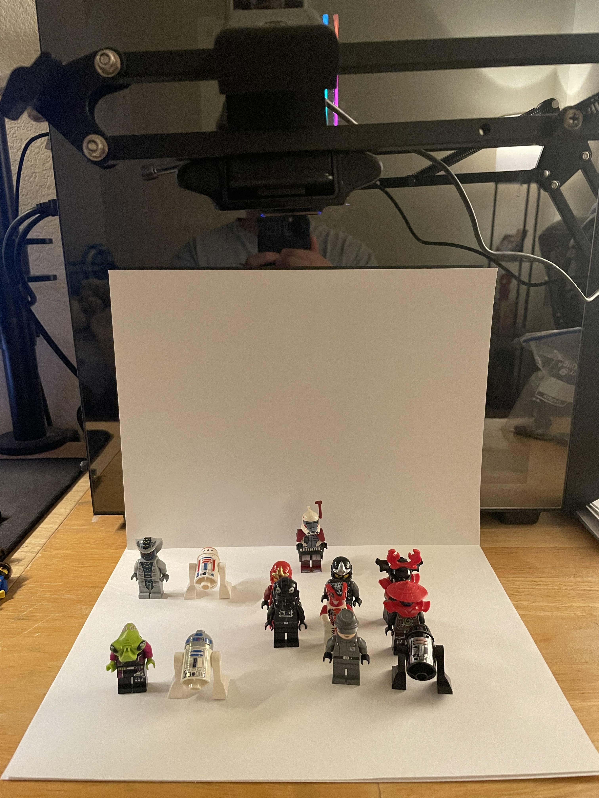
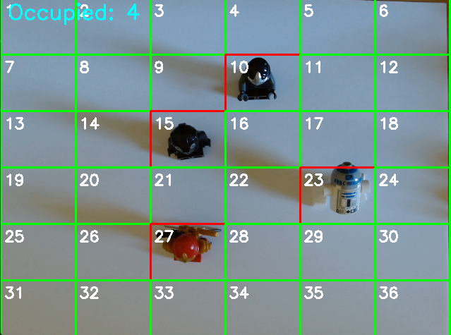

# Grid Occupancy Detection with OpenCV

A computer vision project that detects and counts occupied zones in a 6x6 grid using a live webcam feed. This system applies image processing techniques to estimate occupancy in real time, useful for crowd monitoring or object counting applications.

## Features
- Live video feed from webcam
- 6x6 grid overlay with numbered cells
- Real-time detection of occupied cells based on pixel intensity
- Visual feedback: green for empty, red for occupied
- Occupancy count displayed on-screen
- Adjustable occupancy threshold for detection sensitivity

## Tools & Libraries
- **Python 3.x**
- **OpenCV (`cv2`)**: Used for image capture, processing, drawing, and display
  - `cv2.VideoCapture`: Captures live video feed
  - `cv2.cvtColor`: Converts frames to grayscale
  - `cv2.GaussianBlur`: Applies a blur to reduce noise and smooth the image, improving thresholding results
  - `cv2.adaptiveThreshold`: Converts grayscale to binary image for better lighting invariance
  - `cv2.countNonZero`: Counts the number of bright pixels to estimate occupancy
  - `cv2.rectangle` & `cv2.putText`: Draws the grid and overlays numbers and counts
- **NumPy (`numpy`)**: Used for array operations and pixel computations

## How It Works
1. **Capture frame** from webcam (`cv2.VideoCapture`).  
2. **Flip the frame horizontally** for natural camera mirroring.  
3. **Divide the frame into a 6x6 grid**; each cell is analyzed individually.  
4. **Convert to grayscale** and apply **Gaussian blur** (`cv2.GaussianBlur`) to reduce noise, which improves thresholding reliability.  
5. Apply **adaptive thresholding** to generate a binary image that highlights dark pixels while compensating for uneven lighting.  
6. For each grid cell:
   - Count dark pixels using `cv2.countNonZero`.  
   - Compare the darkness ratio to an occupancy threshold (10% by default).  
   - Draw a colored rectangle: **red if occupied, green if empty**.  
   - Label the cell with its number for reference.  
7. Display **total occupied cells** on the frame.  
8. Show the processed grid in a live window, updating in real time.  
9. Exit when the user presses `'q'`.

## Apparatus
**Hardware / Camera Setup:**  


**Grid Visualization:**  


## How to Run
1. Install dependencies:

```bash
pip install opencv-python numpy

